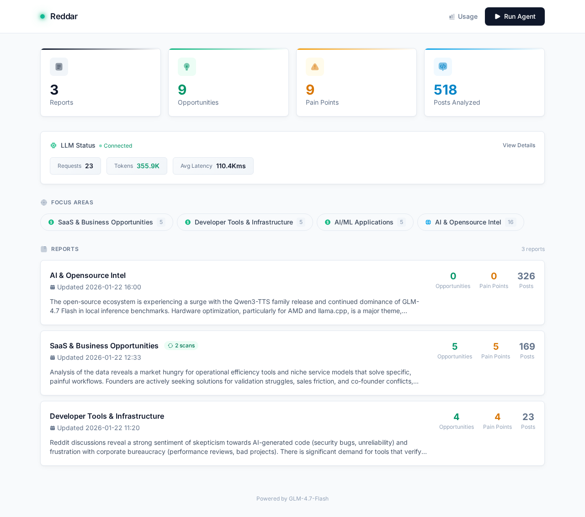
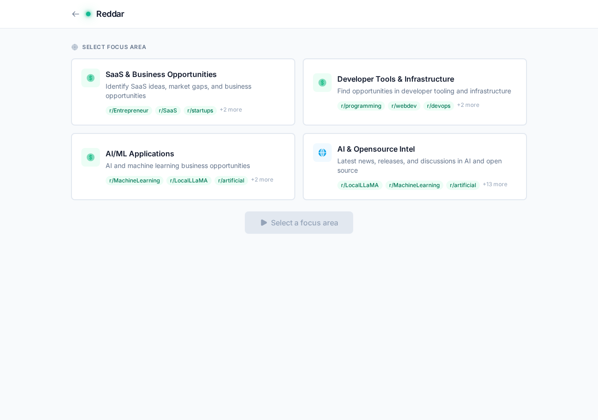
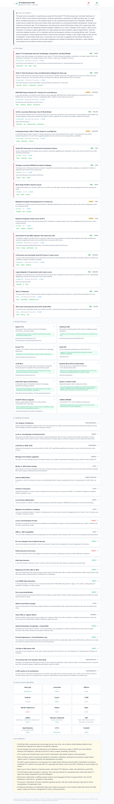
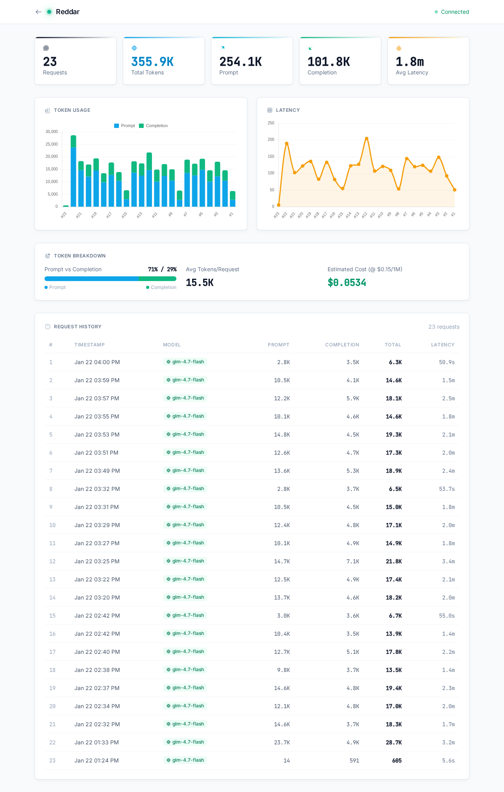

# Reddar

> Reddit Intelligence Agent - Autonomous scanning and analysis of Reddit for business opportunities and tech news.

Reddar scrapes Reddit, analyzes posts with a local LLM, and presents actionable insights through a clean web dashboard.

## This is a Fork of: https://github.com/nexty5870/Reddar

## Features

- **Multi-mode Analysis**: Opportunity discovery or news/intel gathering
- **Batch Processing**: Handles large datasets by splitting into manageable chunks
- **Report Merging**: Accumulates insights across multiple scans, deduplicating automatically
- **LLM Usage Tracking**: Full visibility into token consumption and request history
- **Clean Dashboard**: Modern UI with real-time progress streaming

## Screenshots

### Dashboard


### Run Agent


### Report View


### LLM Usage


## Requirements

- Python 3.10+
- Local LLM server: [Ollama](https://ollama.ai) (easiest), SGLang, vLLM, or OpenAI API
- ~8GB+ VRAM for recommended models (or use smaller quantized models)

## Quick Start

```bash
# Clone the repo
git clone https://github.com/nexty5870/Reddar.git
cd Reddar

# Install dependencies (creates venv automatically)
./start.sh install

# Copy and configure your settings
cp config.yaml.example config.yaml
# Edit config.yaml to set your LLM provider (ollama, sglang, vllm, openai)

# Run the agent and open dashboard
./start.sh
```

Visit `http://localhost:8501` to access the dashboard.

## Configuration

Edit `config.yaml` to customize:

```yaml
# LLM Settings
llm:
  provider: "sglang"  # ollama, sglang, vllm, openai, openai-compatible
  model: "glm-4.7-flash"
  max_tokens: 8000
  temperature: 0.7

# Focus Areas - define what to scan
focus_areas:
  saas_opportunities:
    name: "SaaS & Business Opportunities"
    description: "Identify SaaS ideas and market gaps"
    subreddits:
      - Entrepreneur
      - SaaS
      - startups
    keywords:
      - "I wish there was"
      - "looking for a tool"

  ai_opensource_news:
    name: "AI & Opensource Intel"
    mode: "news"  # Different analysis mode
    subreddits:
      - LocalLLaMA
      - MachineLearning
      - opensource
```

## LLM Providers

Reddar supports multiple LLM backends. Set the `provider` field to auto-configure defaults, or override with custom settings.

### Ollama

```yaml
llm:
  provider: "ollama"
  model: "llama3.2"  # or mistral, qwen2.5, codellama, etc.
```

Default endpoint: `http://localhost:11434/v1`

### SGLang / vLLM

```yaml
llm:
  provider: "sglang"  # or "vllm"
  model: "glm-4.7-flash"
```

Default endpoint: `http://localhost:8000/v1`

### OpenAI

```yaml
llm:
  provider: "openai"
  model: "gpt-4o-mini"
  api_key: "sk-..."
```

Default endpoint: `https://api.openai.com/v1`

### Generic OpenAI-Compatible

For any OpenAI-compatible endpoint:

```yaml
llm:
  provider: "openai-compatible"
  base_url: "http://your-server:8000/v1"
  model: "your-model"
  api_key: ""  # if required
```

## Modes

### Opportunities Mode (default)
Extracts:
- Business opportunities with demand signals
- Pain points and unmet needs
- Market insights
- Recommended actions

### News Mode
Extracts:
- Top stories with importance ranking
- Notable releases
- Trending discussions
- Tools mentioned with sentiment

## Architecture

```
reddar/
├── start.sh            # Main entry point - run everything from here
├── config.yaml.example # Configuration template
├── config.yaml         # Your local config (gitignored)
├── src/
│   ├── scraper.py      # Reddit JSON API scraper
│   ├── analyzer.py     # LLM analysis with batching
│   └── agent.py        # Pipeline orchestrator
├── web/
│   ├── app.py          # Flask dashboard
│   └── templates/      # Jinja2 templates
├── data/               # Scrape data (gitignored)
├── reports/            # Generated reports (gitignored)
└── venv/               # Python virtual environment (gitignored)
```

## Usage

All commands go through `start.sh`, which handles venv detection and LLM validation.

```bash
# Run default agent (saas_opportunities) + open dashboard
./start.sh

# Run specific focus area + dashboard
./start.sh dev_tools
./start.sh ai_opensource_news

# Run agent only (no dashboard)
./start.sh agent ai_ml

# Run all focus areas
./start.sh all

# Just open the dashboard (view existing reports)
./start.sh web

# Just scrape Reddit (no analysis)
./start.sh scrape dev_tools

# Just analyze existing scrape data
./start.sh analyze dev_tools

# Check status (LLM connection, dashboard, token usage)
./start.sh status

# List available focus areas
./start.sh list

# Stop dashboard
./start.sh stop

# Install/update dependencies
./start.sh install

# Show all commands
./start.sh help
```

## License

MIT
